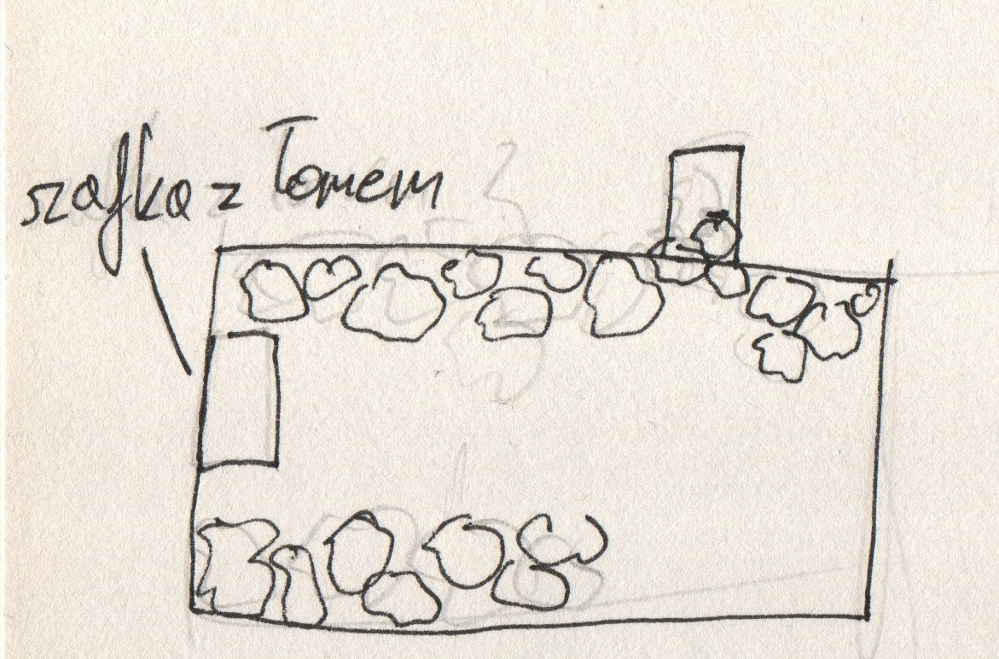
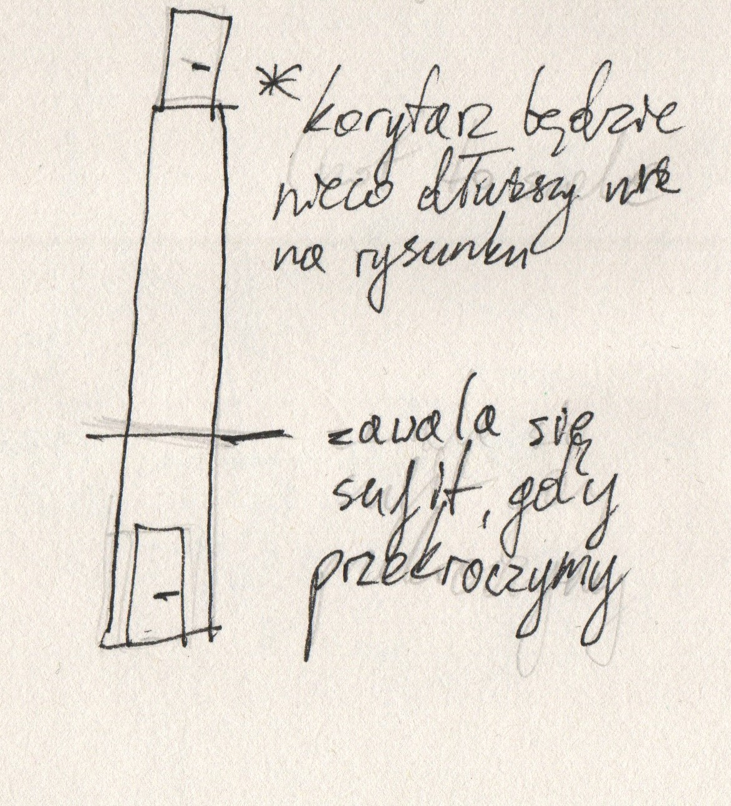
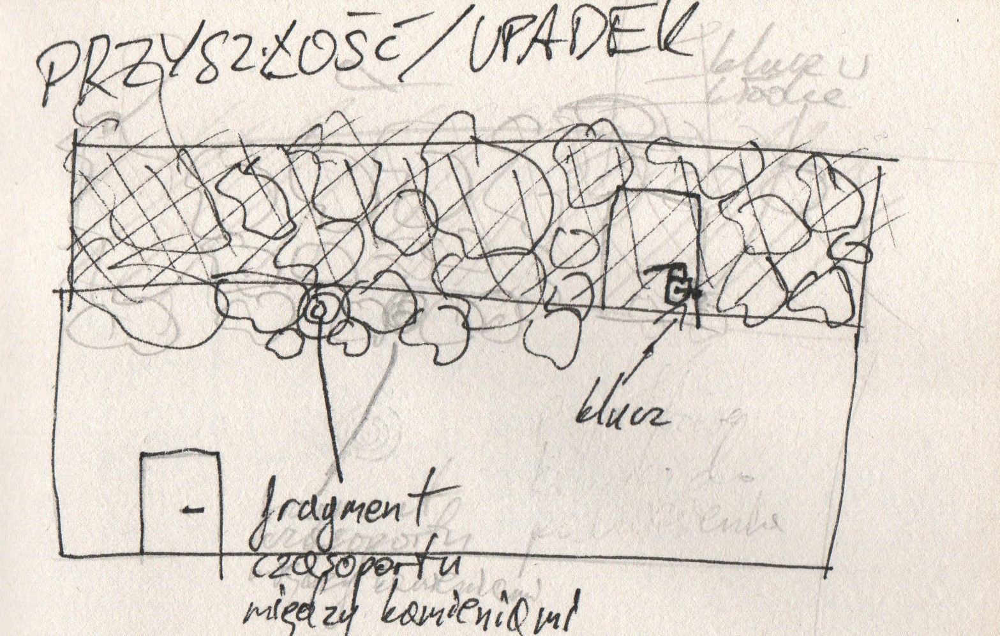
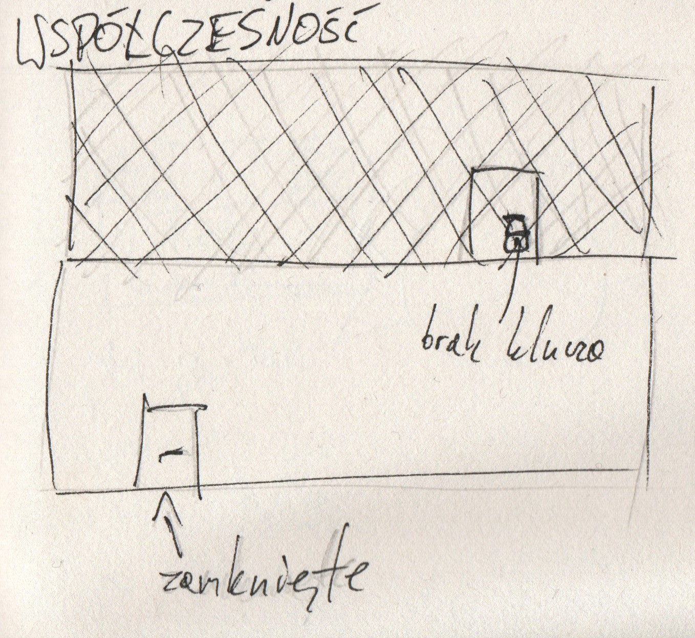

# Samouczek
### [<-- GDD](../GDD.md)

---
Tekst w nawiasach () to prompty, które będą się wyświetlać na ekranie gracza podczas samouczka, aby pokazać mu kontrole. W akcjach uwzględniony jest tylko jeden przycisk (np. LPM), ale mogą wyświetlać się wszystkie możliwości (LPM, J, F, South)

W nawiasach [] wypisane są przedmioty do podniesienia.

## Area 1

Teleportujemy się do zniszczonej przyszłości. Znajdujemy się w zniszczonym magazynie. W pomieszczeniu mogą być futurystyczne pudła, szafki, półki itp. Wyraźnie widać ślady wybuchu, jednym z nich są zawalone gruzem drzwi. Oświetlenie zapewnia dziura w suficie.

Mamy czasoport, ale nie mamy części, które pozwalają na przenoszenie się w czasie.

Przechodzimy się po pomieszczeniu (WSAD - chodzenie)  
Na ziemi leży [młotek] (LPM - podnoszenie).  

Drugie co rzuca nam się w oczy to drzwi, które są oczywiście zablokowane, po interakcji z nimi dostajemy informację że potrzebujemy czegoś do odsunięcia gruzu - rozpoczynamy więc przeszukiwanie pomieszczenia i podnoszenie następnych itemów.  
Rzeczy na podłodze to póki co zapychacze eq, [kamień], [deska], lub [placeholdery], ale po lewej stronie pomieszczenia znajduje się szafka, która po otwarciu przyciskiem interakcji ma w sobie [łom], niezbędny do odsłonięcia drzwi.

Po podniesieniu łomu otrzymujemy podpowiedź (prompt) jak go wybrać w ekwipunku, (PPM - użycie przedmiotu / 1,2,3 - wybieranie z ekwipunku) 

Po czym używamy go do otwarcia drzwi  

## Area 1.5

Wchodzimy do długiego korytarza. Otrzymujemy powiadomienie dźwiękowe (lub inne ostrzeżenie, np. trzęsienie się ekranu i dźwięk spadających kamieni), a po przejściu pewnej odległości korytarz zaczyna się walić - (Tryb biegu - shift [przytrzymanie])
Wybiegamy z walącego się korytarza i wpadamy do następnego pomieszczenia.

## Area 2

W tym pomieszczeniu prąd dawno nie działa, pokój jest opustoszały i opuszczony. Siatka znajdująca się w pomieszczeniu oddziela nas od schodów prowadzących na górę. W siatce znajdują się drzwi zamknięte na kłódkę.  
Pokój ten jest byłym magazynem/pomieszczeniem z generatorami, bezpiecznikami itp., powinien on wyglądać na zamieszkiwanego w przeszłości i wskazywać na zagładę właścicieli - nie tylko ten pokój ale całą lokacja samouczka.   

Przeszukujemy więc pomieszczenie dostając kilka opisów (przy interakcjach nasza postać może powiedzieć coś krótkiego). 

Obok siebie znajdują się 3 przedmioty, [fragment czasoportu pozwalający na przenoszenie się do współczesności] i 2 bezużyteczne [kamienie] (Zmiana celu interakcji – L)

Dodatkowo, jeśli nazbieraliśmy się śmieci uczymy się jak je wyrzucać (Wyrzucenie przedmiotu – T)

(Użycie czasoportu - Q (do tyłu) E (do przodu)) - w tym momencie gracz ma możliwość przenoszenia się jedynie pomiędzy upadkiem a współczesnością.

Przenosisz się do współczesności. Prąd działa, pokój jest oświetlony, ale potrzebujesz klucza (z przyszłości), lub młotka, aby otworzyć drzwi.
Po użyciu klucza możesz wyjść przez drzwi, na schody, które się za nimi znajdują.

## Area 3

Wychodzisz schodami do "głównej strefy" gry. Pewnego rodzaju main hub (ala Metroidvania). Jest to już koniec samouczka.

Myślimy, że main hub będzie rynkiem/galerią handlową wewnątrz świątyni, ale jeszcze musimy to przemyśleć. 

Oczywiście w tej wersji gry ten main hub nie będzie bardzo rozbudowany, gdyż tworzymy tylko jedną ścieżkę fabularną.
