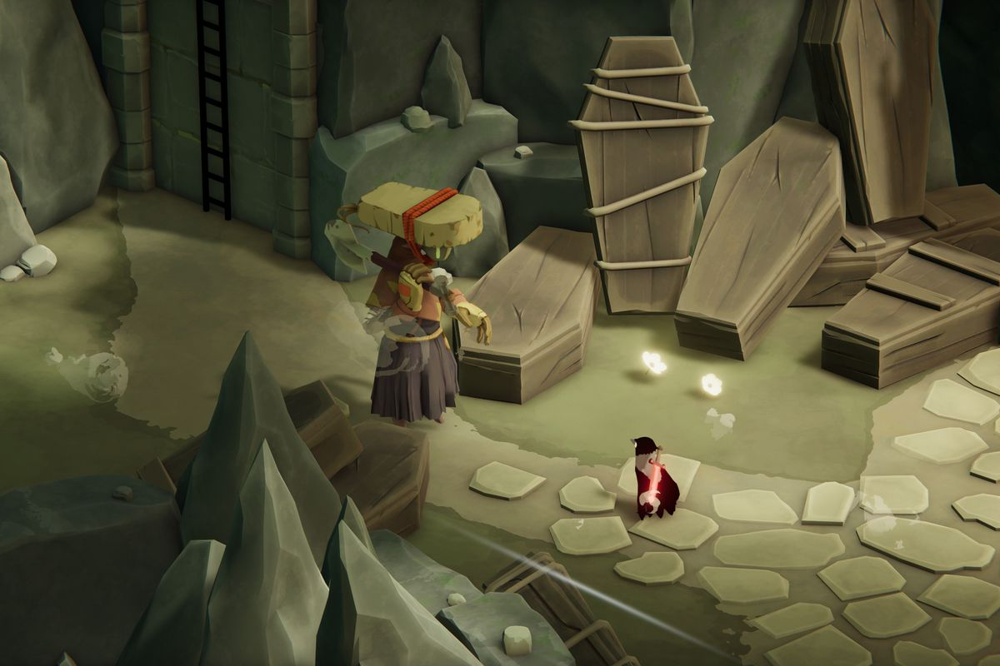
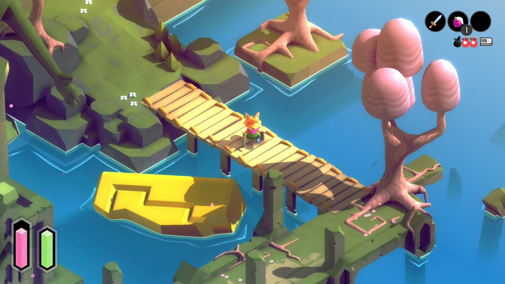

# Nazwa gry: **Timeport**

## Opis świata Gry

Świat gry podzielony jest na 3 przestrzenie czasowe:
 - początki cywilizacji - dominują tam wydeptane szlaki, lasy, pola, małe osady, namioty z liści, domki z gliny, pierwsze uprawy, itp.
 - złoty wiek cywilizacji - dominują tam twierdze, miasta, świątynie, wsie, itp.
 - upadek cywilizacji - dominują tam ruiny, wody zanieczyszczone kwasem, skażona atmosefera, ogólny niepokój, itp.

Składa się on z wielu plansz przedstawiających pojedyczne lokalizacje, pomiędzy którymi gracz może swobodnie się przemieszczać.

Niektóre plansze przeznaczone będą do eksploracji, a niektóre stawiać będą przed graczem przeszkody.

---

## Główny Bohater

Bezimienny kandydat na stażystę `Komisji Czasoprzestrzennej`. W przeciwieństwie do reszty postaci spotkanych podczas rozgrywki jest człowiekiem.

---

## Grafiki koncepcyjne

---

## Gatunek oraz Styl

- **Gatunek** - Future Fantasy Adventure and Puzzle
- **Rodzaj Grafiki** - 2.5D, styl wykonania do ustalanie z grafikami
- **Widok** - Isometryczny

---

## Mechanika wyróżniająca grę

Rozgrywka w kilku przestrzeniach czasowych, pomiędzy którymi gracz może przemieszczać się w dowolnym momencie. Pozwala to na obchodzenie przejść, używanie przedmiotów z jednej przestrzeni w innej, zmianie stanu przestrzeni znajdującej się dalej w przyszłość, itp.

<!-- Drogi sa bezpieczne, na ekranie jest wskaźnik bezpieczeństwa teleportacji. -->

---

## Używane Technologie

- **Silnik**: `Unity 2021.3.12f1`
- **Edytor Graficzny:** Według uznania grafików

---

## Marketing oraz Monetyzacja

- **Grupa Docelowa** - Gen z
- **Monetyzacja** -  ...

---

# [--> Pełna Dokumentacja <--](/GDD/GDD.md)

