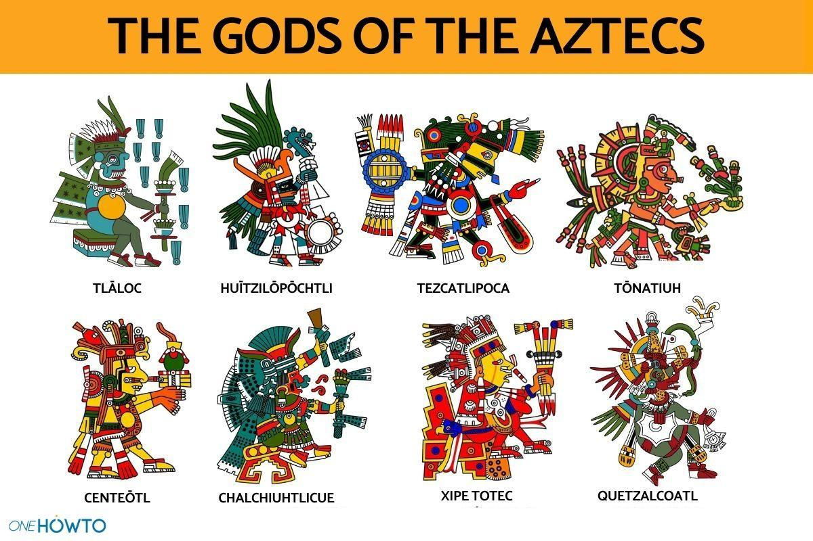

# Postacie i obiekty
### [<-- GDD](/GDD/GDD.md)

---
---

## Postacie występujące w grze

**(Ostateczne wyglądy zależne od grafików, to są jedynie pomysły, ale inspiracja kulturami prekolumbijskimi jest ważna)**

## Postać gracza

Najważniejszą postacią w grze jest postać gracza. Postać na ogół nie będzie wiele mówić. Jest bardziej po prostu sposobem, w jaki gracz może poruszać się po świecie i wchodzić z nim w interakcję. Postać gracza przy interakcji z niektórymi przedmiotami może podawać wskazówki w formie dymku dialogowego.

Ubiór postaci będzie przypominał ubiór reszty Ziemian – nowoczesny i inspirowany połączeniem konkwistadora z astronautą. Będzie to wyraźna odskocznia od wyglądu obywateli planety, którą gracz ma za zadanie “uratować”.

Płeć postaci nie odgrywa tu zbyt wielkiej roli, ale ważne żeby wyglądała na około 20-25 lat.

## NPC

Z reguły żadna postać nie będzie nazywana po imieniu, gdyż mówić będą bardzo mało. W tym momencie nie ma konkretnego wyglądu żadnej postaci, ale wygląd obywateli świata, “ratowanego” przez gracza będzie inspirowany aztekami i ich bóstwem. Kolor skóry może być żółty, czerwony, niebieski, a ich ubiór będzie bardziej “kwadratowy” i kanciasty w porównaniu z bardziej zaokrąglonym wyglądem gracza. Ci obywatele mogliby też różnić się od ludzi, np. większa ilość kończyn, lekko nieludzkimi kształty, itp.  

Ważne jednak, aby nie byli zbyt "obcy".   
Nie mają odstraszać gracza. Mają po prostu sprawiać wrażenie mieszkańców, którzy jednak nie są dokładnie tacy jak gracz. Mają oni swoje prace i życia, ale nie są one zbyt ważne dla gracza, chyba, że musi z nimi wejść w interakcję.

	  
---

## Przedmioty

Przedmioty są bardzo ważną częścią gry i będzie ich stosunkowo wiele. Większość z nich będzie wykorzystywana do rozwiązywania zagadek i przekonywania bądź niwelowania NPC.  
Gracz bedzie w stanie łączyć lub ulepszać niektóre przedmioty w specyficznych miejscach.

Przedmioty mogą być brońmi, kluczami, narzędziami, itp.  
Dokładne przedmioty powstaną przy wypisywaniu fabuły.

Jedynym przedmiotem różniącym się od reszty jest czasoport, ale on nie jest umieszczony w ekwipunku. Gracz zawsze go ma – jest integralną mechaniką gry jedynie przedstawioną w postaci fizycznej.

